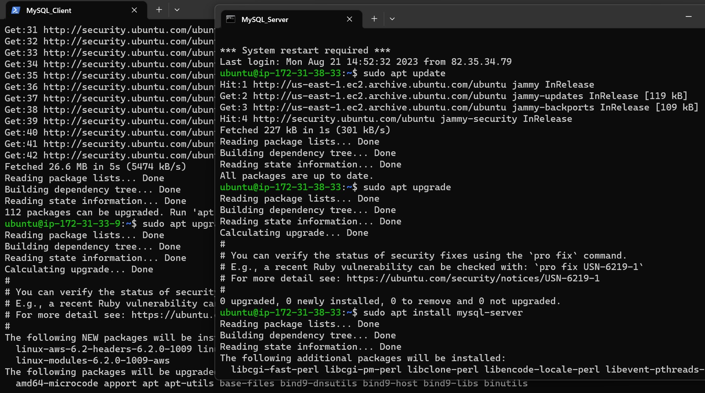
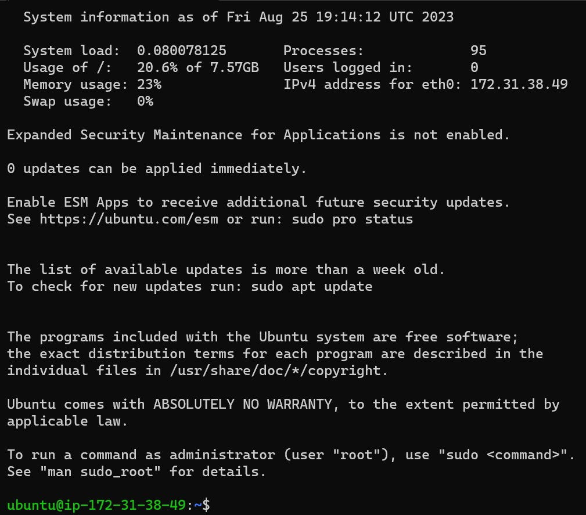
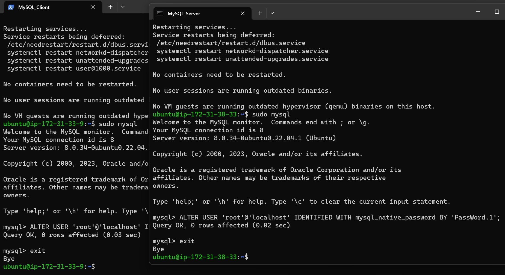
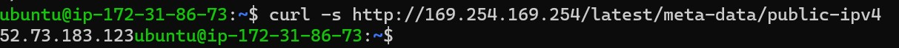
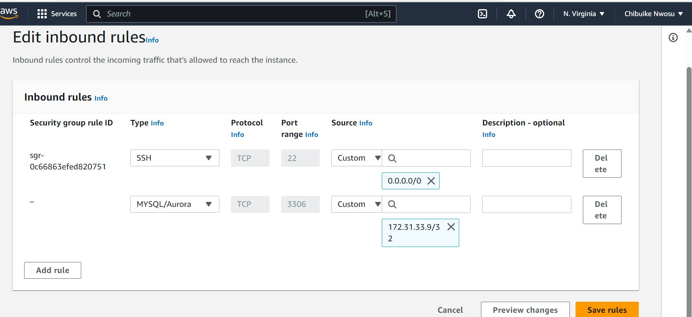
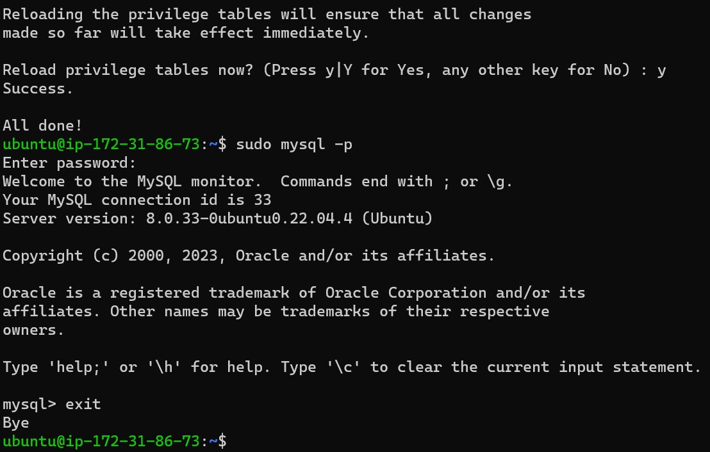
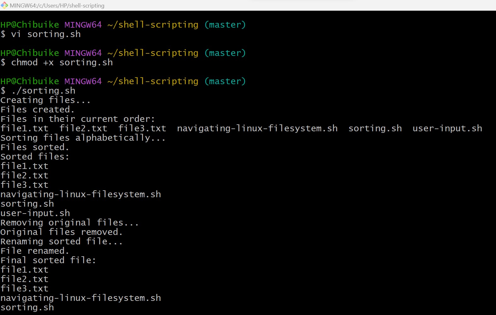
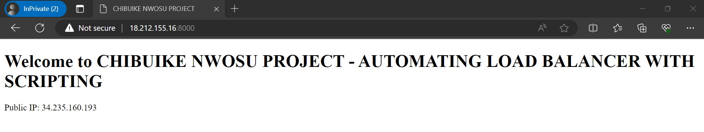
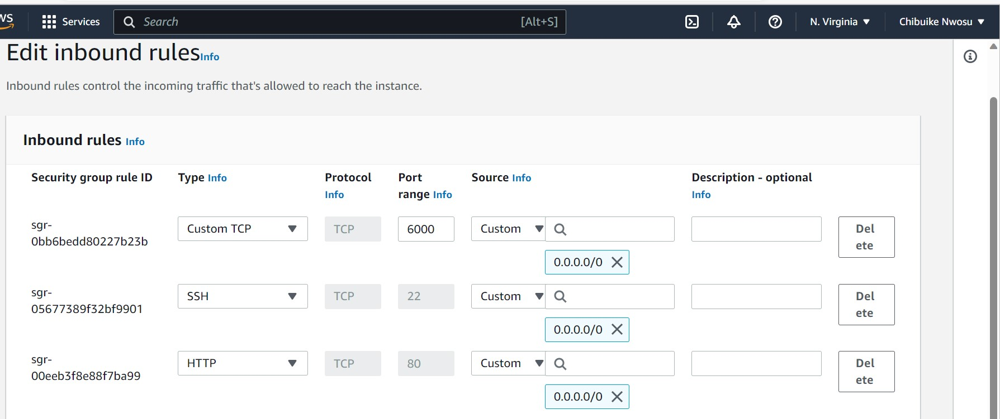

# LAMP STACK IMPLEMENTATION

This project outlines the implementation process of a LAMP (Linux, Apache, MySQL, PHP) Stack on Linux-based server. It provides step-by-step instructions with screenshots from my Lab for installing and configuring each component of the stack, along with basic security considerations.

**LAMP stack** is an open-source software bundle used to build websites and web applications. LAMP is an acronym that consist of these four main components/operating system:

* **L - Linux**: The operating system that provides the foundation for the stack.
* **A - Apache**: A web server(HTTP Server) software that serves web content to users.
* **M - MySQL**: A relational database management system used to store and manage data.
* **P - PHP**: A server-side scripting language used to build dynamic web pages and applications.

LAMP stacks is used to create, host, and maintain web content. It is a popular solution that powers many of the websites that is commonly used today.

**Prequisites**:
-
* A Cloud provider Instance (AWS EC2)
* Linux distribution (e.g., Ubuntu Server)
* Root or sudo access to the server.

To start this project I inatall an OpenSSH on my windows machine using the below link:
[OpenSSH for Windows](https://learn.microsoft.com/en-us/windows-server/administration/openssh/openssh_install_firstuse?tabs=powershell#install-openssh-for-windows)

Created an instance using my AWS EC2

Connect to EC2 instance via ssh using my Terminal:
* cd Downloads (where my .pem file is located)
* ssh -i <private-key-name>.pem ubuntu@<Public-IP-address>


# Installing Apache And Updating the Firewall
update a list of packages in package manager and run apache package installation.

`sudo apt update` 

`sudo apt install apache2`

To confirm service was running successfuly run the below cmd and if it is Green and running this confirms that the installation was done correctly.
`sudo systemctl status apache2`



Open Port 80 on my EC2 server as this is the default port a web browser use to access web pages.


Run the curl cmd: as this is used to request Apache HTTP Server on open port 80. 
`curl http://localhost:80`
`curl http://127.0.0.1:80`

With this the Apache installation is complete and for confirmation, run the below cmds to view your webpage:
`http://<Public-IP-Address>`
`http://<Public-IP-Address>:80`

N/B - You can also get the Public IP using running the below cmd on your terminal:
`curl -s http://169.254.169.254/latest/meta-data/public-ipv4`


On your web browser type **http://<Public-IP-Address>:80** if the below default page output is what you get then it confirms that the web server is installed correctly and can be accessed through port 80.


## Installing MySQL Database
To start the installion of mysql-server run the below and when prompted confirm installation by typing Y:
`sudo apt install mysql-server`

Run the below cmds to connect to MYSQL server administractve database:

`sudo mysql
ALTER USER 'root'@'localhost' IDENTIFIED WITH mysql_native_password BY 'PassWord.1';`

`mysql> exit`

To start intractive scripting run.

`sudo mysql_secure_installation`

After the steps above to confirm the installation login to confirm installation and exist:

`mysql -p`

`mysql> exit`



# Installing PHP
To begin the installing on same terminal run the below: 
`sudo apt install php libapache2-mod-php php-mysql`

After the installing to confirm the verison of php installed run the cmd.

`php -v`


At this point the **LAMP stack installation** is complete and fully operational to Lunch a web page as the below has been installed successfully.
* **Linux**
* **Apache**
* **MySQL**
* **PHP**

## Enable PHP on the website:
With the default index settings on Apache index.html will always take precedenceover index.php file. To change this behaviour run the below code:

`sudo vim /etc/apache2/mods-enabled/dir.conf`


Modify using the below arrangement and then save and exit:
```
<IfModule mod_dir.c>
        #Change this:
        #DirectoryIndex index.html index.cgi index.pl index.php index.xhtml index.htm
        #To this:
        DirectoryIndex index.php index.html index.cgi index.pl index.xhtml index.htm
</IfModule>
```
Reload Apache:
`sudo systemctl reload apache2`

Create a new file named index.php
`vim /var/www/projectlamp/index.php`

Add the test file which a valid php code.
```
<?php
phpinfo();
```
* **N/B** - You will need to delete the page after viewing the displayed information as it contains relevant information about the php.
`sudo rm /var/www/projectlamp/index.php`

Create a Virtual Host for the Website using Apache.
Create a directory named projectlamp:

`sudo mkdir /var/www/projectlamp`

Assign ownership of the directory with the **$USER** environment variable as this will reference the current system user.
`sudo chown -R $USER:$USER /var/www/projectlamp`

create a confirguration file the webpage.
`sudo vi /etc/apache2/sites-available/projectlamp.conf`

Paste the configuration file for the webpage.
```
<VirtualHost *:80>
    ServerName projectlamp
    ServerAlias www.projectlamp 
    ServerAdmin webmaster@localhost
    DocumentRoot /var/www/projectlamp
    ErrorLog ${APACHE_LOG_DIR}/error.log
    CustomLog ${APACHE_LOG_DIR}/access.log combined
</VirtualHost>
```

use **:wq + Enter** save and exit. 

Run the below virtual Host configuration as this will notify Apache to serve projectlamp using **/var/www/projectlamp** as its web root directory.

`sudo ls /etc/apache2/sites-available`

Enable the virtual host using the cmd.

`sudo a2ensite projectlamp`

To disable Apache's default website run the below cmds:

`sudo a2dissite 000-default`

Confirm the configuration file does not contain any syntax errors run.
`sudo apache2ctl configtest`

Reload Apache for changes to take effect
`sudo systemctl reload apache2`

The website is now active but the web root is empty, to test if the virtual host works well we will create an index.html file in the location using the cmd.

`sudo echo 'Hello LAMP from hostname' $(curl -s http://169.254.169.254/latest/meta-data/public-hostname) 'with public IP' $(curl -s http://169.254.169.254/latest/meta-data/public-ipv4) > /var/www/projectlamp/index.html`


* **Lets test the webpage by using the URL**

`http://<Public-IP-Address>:80`


---


Did a test by added some words to the Hello LAMP and it also updated.


Thank you


