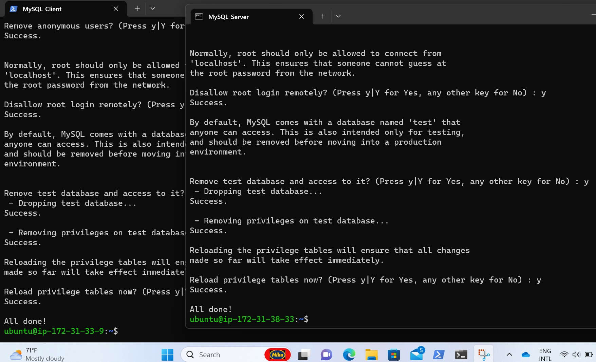
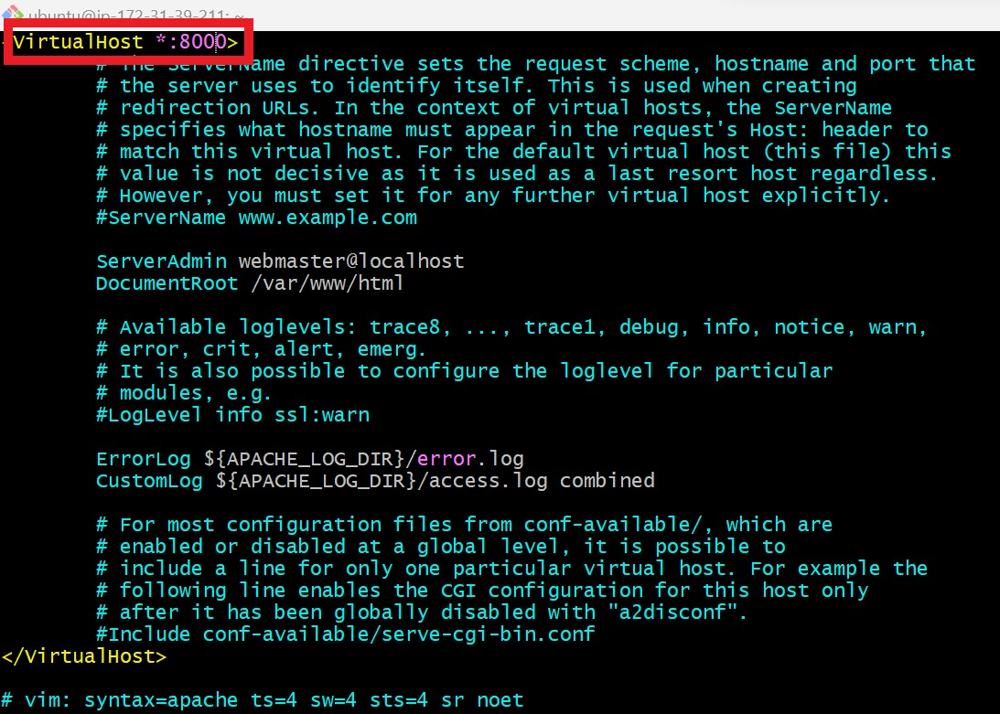
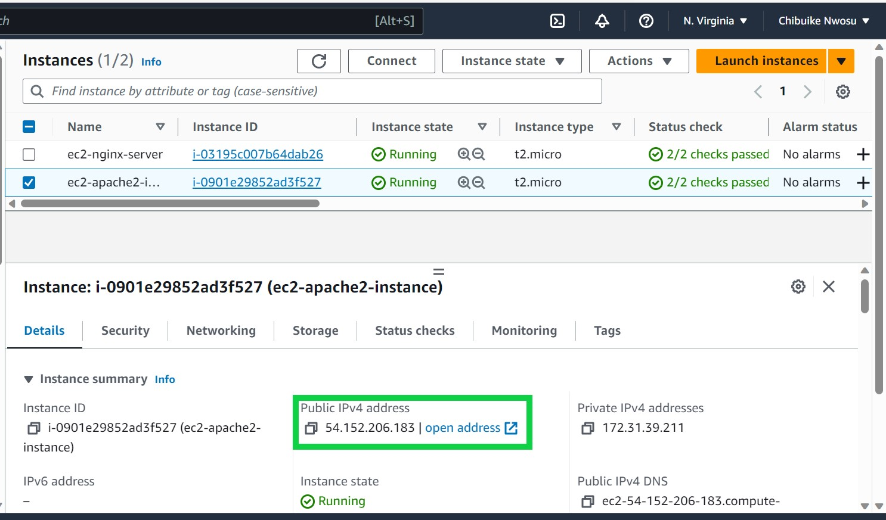
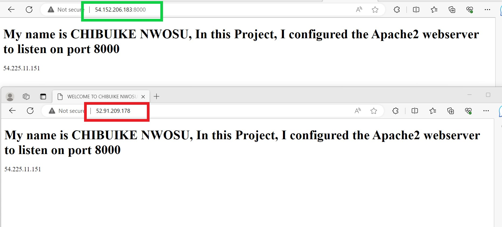

# IMPLEMENTING LOAD BALANCER WITH NGINX WEBSEVER

## Introduction to Load Balancer
In this project I will learn how to distribute traffic efficiently accross mutiple servers, optimise performance and ensure high availability for a web application


         **Load Balancer System Diagram**

The above diagram gives a pictorial definition of a load balancer, which can also be defined as a Device or application that distributes network and/or application traffic accross multiple servers or applications. 

This helps to optimise the use of computing resource, increases the capacity and reliability of applications and prevent network overload.

A load balancer can act like a reverse proxy and can be hardware or virtual machine.

## Setting up a Load Balancer
Create two(2) EC2 VM with Ubuntu server 20.04 LTS and named them ecs-nginx-server and ec2-apache2-server.

**Apache2 Webserver Configuration**

On the apache2 ec2 instance, created an inbound rule to allow traffic/listen to port 8000.


Update the remotely connected SSH EC2 instance and installed apache2 web sever on the terminal.
```
sudo apt update 
sudo apt upgrade 
sudo apt update -y &&  sudo apt install apache2 -y
```


* Confirmed installation was successfull by checking the status.
`sudo systemctl status apache2`


Confirgure the Apache2 to listen to port 8000 as allowed on my instance I need to edit the **port.conf** file, the **000-default.conf** file.

* For the port.conf file, added Listen 8000, used :wq! to save and exit vi editor.

`sudo vi /etc/apache2/ports.conf`


* For 000-default.conf file changed the default Virtual Host to 8000.

`sudo vi /etc/apache2/sites-available/000-default.conf`




Customised the web page by editing the default index.html file of Apache webserver, using **:1,$d** - to highlight and delete all content of the default webserver paste a customised web page code, save and exit **:wq!**.

`vi /var/www/index.html`
```
        <!DOCTYPE html>
        <html>
        <head>
            <title>WELCOME TO CHIBUIKE EC2 INSTANCE</title>
        </head>
        <body>
            <h1>My name is CHIBUIKE NWOSU, In this project I configured the Apache2 webserver to listen on port 8000 </h1>
            <p>Public IP: YOUR_PUBLIC_IP</p>
        </body>
        </html>
```
* Run the below cmd as this will restart the server and update the changes/configurations.

`sudo systemctl restart apache2`

At this point we have successufully completed the apache2 webserver set up, to test we need to use the public IP and the port.

`54.225.11.151:8000`


-----

**Nginx Load Balancer Configuration**

Set up http inbound rule and open port 6000 on the AWS instance.


SSH remotely to EC2 instance, update, upgrade and install the nginx webserver.
```
sudo apt install update 
sudo apt install upgrade 
sudo apt update -y && sudo apt install nginx -y
```
* Confirm if the installation was successful by running the below cmd.

`sudo systemctl status nginx`

Open nginx configuration file.

`sudo vi /etc/nginx/conf.d/loadbalancer.conf`

 * Paste the below configuration file that will enable the nginx webserver to act as a Load balancer.
```
        upstream backend_servers {

            # your are to replace the public IP and Port to that of your webservers
            server 54.152.206.183:8000; # public IP and port for webserser 1
            server 52.91.209.178:6000; # public IP and port for webserver 2

        }

        server {
            listen 80;
            server_name 52.91.209.178; # provide your load balancers public IP address

            location / {
                proxy_pass http://backend_servers;
                proxy_set_header Host $host;
                proxy_set_header X-Real-IP $remote_addr;
                proxy_set_header X-Forwarded-For $proxy_add_x_forwarded_for;
            }
        }
```
* **N/B** This confirguration is not static as the public IP address are from my AWS instance, this can be changed to suit your configuration.

* Test my nginx configuration to congirm if its successful.

`sudo nginx -t`


* Restart nginx server to allow for the configurations to take effect.

`sudo systemctl restart nginx`

At this point we are fine with the setup/configuration for the nginx server to act as a Load balancer, however to prove the success of this configuration I will use the nginx public ip to make a request to the apache2 webserver, the result/output will be the configuration on set up on my apache2 server.
 
The request will done using the publis IP of the apache2 and nginx web server to see if it will give us same result.

* Public IP Nginx server (Load Balancer)


* Public IP Apache2


* Web page request using nginx and apache2 public IP.



## _Thank You_