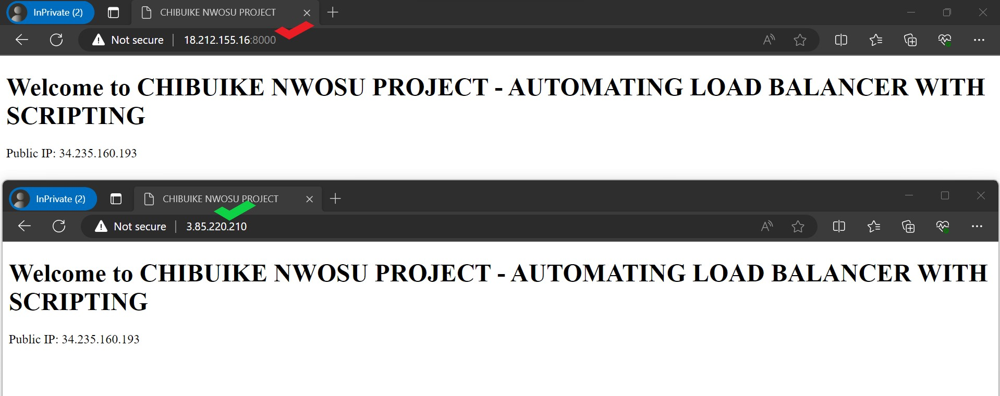

# AUTOMATING LOAD BALANCER CONFIGURATION WITH SHELL SCRIPTING USING NGINX
As a DevOps engineer, scripting plays a crucial role in automating various processes within development and IT operations. Some key reasons why automation through scripting is essential in the DevOps practice are as listed below:

* Efficiency and Consistence
* Rapid Deployment
* Infrastructure as Code (IaC)
* Scalability
* Reduced Risk
* Traceability and Auditing
* Time Savings
* Adaptability

In this project we are going to use scipt to install, update and configure webservers(Apache2 and Nginx), this script will also automate the confirguration of using Nginx webserver as a Load balancer.

To start the project we would initiate or spin up **two(2)** EC2 instances using **Ubuntu 22.04** and **SSH** both instances to any of our choice terminals, in this I will be using two different terminal Git Bash and PowerShell.


Connected the both instances and run the update and upgrade using the below cmds:
```
sudo apt update 
sudo apt upgrade
```
Open port 8000 on the inbound security rule.


## Automate the Deployment of Apache2 Webserver using Shell Scripting

Create and open a file to paste script, and use :wq! to exit the vi editor. 

`sudo vi install.sh`

Paste the below script in the vi editor to configure the Apache2 server and save and exit using **:wq!**

```
#!/bin/bash

####################################################################################################################
##### This automates the installation and configuring of apache webserver to listen on port 8000
##### Usage: Call the script and pass in the Public_IP of your EC2 instance as the first argument as shown below:
######## ./install_configure_apache.sh 127.0.0.1
####################################################################################################################

set -x # debug mode
set -e # exit the script if there is an error
set -o pipefail # exit the script when there is a pipe failure

PUBLIC_IP=$1

[ -z "${PUBLIC_IP}" ] && echo "Please pass the public IP of your EC3 instance as an argument to the script" && exit 1

sudo apt update -y && sudo apt install apache2 -y

# Ensure Apache service is running
sudo systemctl start apache2

if [[ $? -eq 0 ]]; then
    # Change permissions for necessary files and directories
    sudo chmod 777 /etc/apache2/ports.conf
    sudo chmod 777 -R /etc/apache2/
    sudo chmod 777 -R /var/www/html/

    # Update VirtualHost configuration
    sudo sed -i 's/<VirtualHost \*:80>/<VirtualHost *:8000>/' /etc/apache2/sites-available/000-default.conf

    # Create and configure the index.html file
    sudo tee /var/www/html/index.html >/dev/null <<EOF
<!DOCTYPE html>
<html>
<head>
    <title>CHIBUIKE NWOSU PROJECT</title>
</head>
<body>
    <h1>Welcome to CHIBUIKE NWOSU PROJECT - AUTOMATING LOAD BALANCER WITH SCRIPTING</h1>
    <p>Public IP: ${PUBLIC_IP}</p>
</body>
</html>
EOF

    # Restart Apache service
    sudo systemctl restart apache2

    echo "Apache configuration completed."
else
    echo "Apache installation or configuration failed."
fi
```


Change permission to allow for executation of the script in the install.sh file.

`sudo chmod +x install.sh`

Run the script after exiting the vi editor using the below cmd.
```
./install.sh PUBLIC_IP 
        or 
sudo ./install.sh PUBLIC_IP
```


At this point we are done with the Apache2 webserver configuration, we can now use the Public IP of the Apache2 webserver to confirm


## Automate the Deployment of Nginx Webserver as a Load Balancer using Shell Scripting.
On the EC2 instance create open HTTP port to allow for traffice anywhere in the inbound rule.


I Update and upgrade the terminal, created a **.sh** file to store my script that will automate the process using the below cmd.

`sudo vi nginx.sh`

Paste the below script in the vi editor, save and exit the editor using **:wq!**
```
#!/bin/bash

PUBLIC_IP="3.85.220.210"
firstWebserver="18.212.155.16"
secondWebserver="3.85.220.210"
loadbalancerConfig="/etc/nginx/conf.d/loadbalancer.conf"

set -x # Enable debug mode
set -e # Exit on error
set -o pipefail # Exit on pipeline failure

# Install Nginx if not already installed
if ! command -v nginx &> /dev/null; then
    sudo apt update -y
    sudo apt install nginx -y
fi

# Retrieve content from the firstWebserver
webpage_content=$(curl -s http://18.212.155.16:8000)

# Prepare the configuration content
config_content="upstream backend_servers {
    server 18.212.155.16:8000; # public IP and port for webserser 1
    server 3.85.220.210; # public IP and port for webserver 2
}

server {
    listen 80;
    server_name 3.85.220.210; # provide your load balancer's public IP address

    location / {
        proxy_pass http://backend_servers;
        proxy_set_header Host \$host;
        proxy_set_header X-Real-IP \$remote_addr;
        proxy_set_header X-Forwarded-For \$proxy_add_x_forwarded_for;
    }
}"

# Update loadbalancer.conf with the prepared configuration content
echo "$config_content" | sudo tee "$loadbalancerConfig" > /dev/null

# Test Nginx configuration
sudo nginx -t

# Restart Nginx if configuration is valid
if [[ $? -eq 0 ]]; then
    sudo systemctl restart nginx
fi
```


Change permission for the file/script to be executable.

`sudo chmod +x nginx.sh`

Run the scrit using the below cmd.
```
./nginx.sh PUBLIC_IP Webserver-1 Webserver-2
        or 
sudo ./ninx.sh
```
At this point we have successfully automated the installation of the Apache2 server, the Nginx webserver and also confingured the Nginx webserver as a Load balancer using shell scripting.

To confirm the successful configuration/automation using the script we need to test both webservers as they should give same output using their different Public IP address. See below screenshot for confirmation.

Below screenhot shows the Public IPs of the Apache2 websever and the Nginx webserver.
* Apache2


* Nginx


The screenshot below shows the two Public IP address of Apache2 webserver and Nginx webserver displaying same web output as it confirms a successfull configuration.




# **_Thank you_**