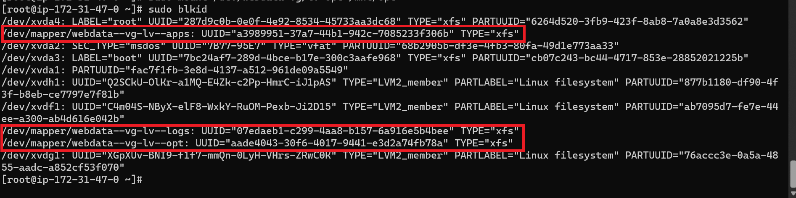

# DEVOPS TOOLING WEBSITE
In this project we will use some set of tools that will be used in day to day activities in managing, developing, testing, deploying and monitoring different project.

# **Prequisities**
To implement this project successfully it will consist of the below components:
* Infrastructure: AWS
* Webserver Linux: Red Hat Enterprise Linux 9
* Database Server: Ubuntu 22 + MySQL
* Storage Server: Red Hat Enterprise Linux 9 + NFS Server
* Programming Language: PHP
* Code Repository: GitHub

Th diagram below shows a pictorial implementation of the project and how stateless Web Servers share a common datatbase and access the same files using Network File System(NFS) as a shared storage, Even though the NFS server in a different location, however for the Web Servers they see it as a local file where they can serve same file.


**NFS:** Is a mechanism for storing files on a network. It is a distributed file system that allows users to access files and directories located on remote computers and treat those files and directories as if they were local.

Step 1: Prepare the NFS server
1. Spin up a new AWS ECS instance with RHEL Linux 9
2. Create three(3) Logical Volumes and attach it to the created instance.


3. SSh into the instance and confirm if the mounts are attached correctly using `lsblk`


4. Create a gdisk utility to create partition of the three volumes **xvdf**, **xvdg** and **xvdh**, confirm the disk are created using `lsblk`
```
sudo gdisk /dev/xvdf
sudo gdisk /dev/xvdg
sudo gdisk /dev/xvdh
```
**N/B** use **n,1,w & y** to successfully partition the disk


* Install **lvm** and check the available partition.
```
sudo yum install lvm2
sudo lvmdiskscan
```
**LVM (Logical Storage management)** - Is a form of storage virtualization for managing disk storage spaces.

.png>)

* Use the `pvcreate` utility to mark each of the three(3) created disk partition to a physical volume(PV) to be used by the LVM using the below cmd and use `sudo pvs` to confirm:
```
sudo pvcreate /dev/xvdf1
sudo pvcreate /dev/xvdg1
sudo pvcreate /dev/xvdh1
```


* Mount all the created Physical Volumes(PVs) to a Volume Group(VG) name webdata-vg using the `vgcreate` 
```
sudo vgcreate webdata-vg /dev/xvdh1 /dev/xvdg1 /dev/xvdf1
sudo vgs
```
* Use the `lvcreate` to create three(3) logical volumes for **lv-opt, lv-apps & lv-logs**, using `sudo lvs` to confirm

**N/B** - from the volume group created we confirm that the volume size is **29.9g**, reasons for using **9G** as this will allow for even distribution spaces to the three logical volume to be created. 
```
sudo lvcreate -n lv-opt -L 9G webdata-vg
sudo lvcreate -n lv-apps -L 9G webdata-vg
sudo lvcreate -n lv-logs -L 9G webdata-vg
```


* sudo vgdisplay

* Formate the three(3) logical volumes with **xfs** file system.
```
sudo mkfs -t xfs /dev/webdata-vg/lv-opt
sudo mkfs -t xfs /dev/webdata-vg/lv-apps
sudo mkfs -t xfs /dev/webdata-vg/lv-logs
```


* Create a directory for the three(3) logical volumes and mount it to the respective directories created for each volumes.
```
sudo mkdir -p /mnt/apps
sudo mkdir -p /mnt/logs
sudo mkdir -p /mnt/opt
sudo mount /dev/webdata-vg/lv-apps /mnt/apps
sudo mount /dev/webdata-vg/lv-logs /mnt/logs
sudo mount /dev/webdata-vg/lv-opt /mnt/opt
```


* Installation and configuration of the NFS server to start on reboot using the below cmd.
```
sudo yum -y update
sudo yum install nfs-utils -y
sudo systemctl start nfs-server.service
sudo systemctl enable nfs-server.service
sudo systemctl status nfs-server.service
```


* Exports mounts for webserver using a **subset cidr** to connect as clients, this will install all the three webservers inside the same subset, but in production its not the bast practise, as its best and advisable to have each on a seperate subset for a higher level of security.

**Subset cidr** - Used to routedata packets through a network to the respective device based on the indicated subnet address.

For this project my subset cidr is `172.31.32.0/20`


* Set permission that will allow all webserver to read write and execute files on the NFS server.
```
sudo chown -R nobody: /mnt/apps
sudo chown -R nobody: /mnt/logs
sudo chown -R nobody: /mnt/opt

sudo chmod -R 777 /mnt/apps
sudo chmod -R 777 /mnt/logs
sudo chmod -R 777 /mnt/opt

sudo systemctl restart nfs-server.service
```

* Configure access for the NFS server for clients within the same subset using the **vi editor** to add the below subset cidr of webserver and exit using `esc+:wq!`.
```
sudo vi /etc/exports

/mnt/apps 172.31.32.0/20(rw,sync,no_all_squash,no_root_squash)
/mnt/logs 172.31.32.0/20(rw,sync,no_all_squash,no_root_squash)
/mnt/opt 172.31.32.0/20(rw,sync,no_all_squash,no_root_squash)

sudo exportfs -arv
```


* Confirm the ports that are used by the NFS server and open it on the security groups.

`rpcinfo -p | grep nfs`


* Check the UUID of the three partition on the device or system to update the `/etc/fstab` file by running the below
```
sudo blkid
vi /etc/fstab
```



* Test the configuration and reload the deamon using the below cmds.
```
sudo mount -a
sudo systemctl daemon-reload
```

## Configure backend database as part of the 3 tier architecture

Step 2 - Configure the database server.
* Create an EC2 instance using RHEL 9
* SSH into the EC2 instance through my Terminal 
* Update, install MySQL Server and enable the service using the below cmds
```
sudo yum update
sudo yum install mysql-server
sudo systemctl enable mysqld
sudo systemctl restart mysqld
```


* Create a database and a using and grant permission to do anything only from the subset cidr.
```
sudo mysql
CREATE DATABASE tooling;
CREATE USER `webaccess`@`172.31.32.0/20` IDENTIFIED BY 'mypass';
GRANT ALL ON tooling.* TO 'webaccess'@'172.31.32.0/20';
SHOW DATABASES;
exit
```


# DOCUMENTATION IN-PROGRESS


/etc/httpd/conf/httpd.conf - log folder for appache2

sudo mysql
CREATE DATABASE tooling;
CREATE USER `webaccess`@`<Web-Server-Private-IP-Address>` IDENTIFIED BY 'mypass';
GRANT ALL ON tooling.* TO 'webaccess'@'<Web-Server-Private-IP-Address>';
FLUSH PRIVILEGES;
SHOW DATABASES;
exit

=================
journalctl -xe
setenforce 0