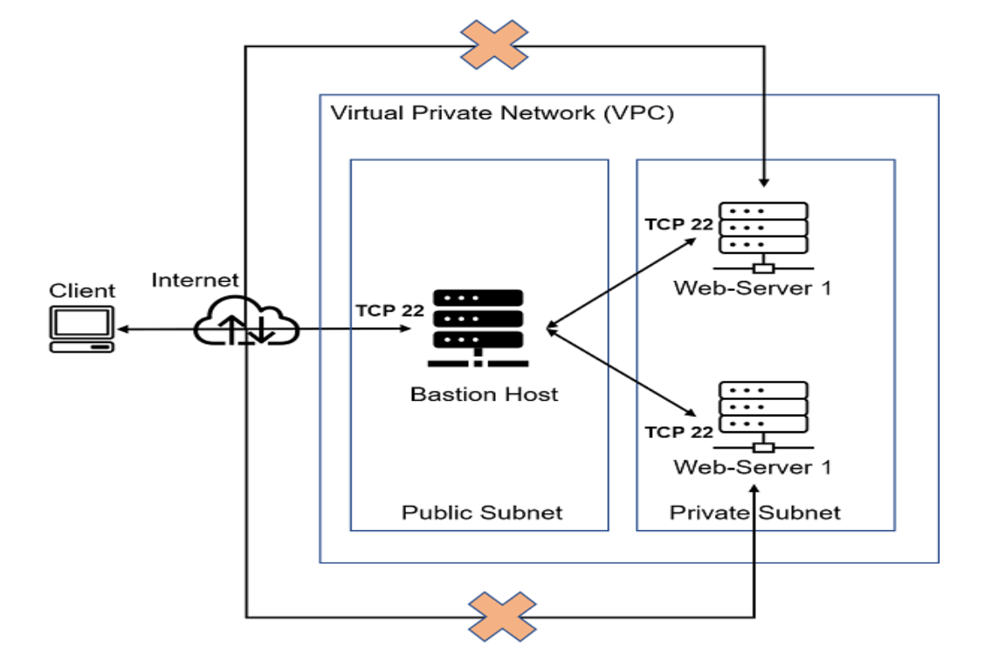
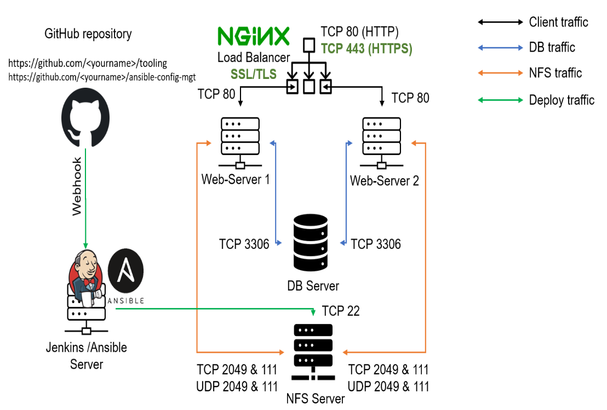

# ANSIBLE CONFIGURATION MANAGEMENT
Ansible is an open source IT automation tool that automates provisioning, configuration management, application deployment, orchestration, and many other manual IT processes. Unlike more simplistic management tools, Ansible can be used to automate software inatallation, automate daily tasks, provision infrastructure, improve security and compliance, patch systems, and share automation across the entire organization.

In this project Ansible Client act as a **Jump Server**(sometimes referred to as Bastion Host), **Jump Server** is an intermediary server through which access to internal network can be provided. In this project architecture the webservers will be inside a secured network which cannot be reached directly from the internet, this means that the webservers can only be accessed through the **Jump Server**, this set up provides better security and reduces attack.

The diagram below is a typical description of that explains a **Jump server/Bastion Host**, the Virtual Private Network (VPC) is divided into two subnets, the Public subset which has a public IP addresses and the Private Subset that is only reachable or accessed by Private IP addresses from the Bastion Host.


## Step 1: Install and Configure Jenkins and Ansible on EC2 instance 

1. Install Jenkins on ec2 instance using the below commands
```
curl -fsSL https://pkg.jenkins.io/debian-stable/jenkins.io-2023.key | sudo tee \
    /usr/share/keyrings/jenkins-keyring.asc > /dev/null

echo deb [signed-by=/usr/share/keyrings/jenkins-keyring.asc] \
    https://pkg.jenkins.io/debian-stable binary/ | sudo tee \
    /etc/apt/sources.list.d/jenkins.list > /dev/null

sudo apt-get update
sudo apt-get install fontconfig openjdk-11-jre
sudo apt-get install jenkins
```
* Install ansible using the below commands
```
sudo apt update
sudo apt install ansible

```
Confirm that ansible is installed on the terminal by confirming the version with **ansible --version** 


To confirm that Jenkins was installed correctly run **sudo systemctl status jenkins**


In other to configure Jenkins, we need to note that jenkins listens to port 8080 by default, however we use the public ip of the instance where jenkins is installed and the port it listens to, the port will be opened on the security group of the instance. The below diagram confirms a complete Jenkins set up.


2. Configure Jenkins build job to archive my repository content each time I make changes to my Github.
* Create a Freestyle project **Chi-test** in Jenkins and point it to my **Ansible-config-mgt** repository.


* Configure a webhook in Github and set the webhook to trigger ansible as the build will be triggerd on any changes made on the Ansible-confi-mgt on Github.


* Configure a Post-build job to save all (**) files.


2. Test all the setup and configuration by making changes on the README.md file on Github to ensure it build successfully and jenkins saves the file(**) by running the below command:

    `ls /var/lib/jenkins/jobs/chi-ansible/builds/<build_number>/archive/`


**N/B** From the above setup and configuration we have the below diagram Architecture:


**Tip:** Everytime we stop/start the Jenkins-ansible server, we have to configure Github webhook to a new IP address, but in other to avoid it, we can allocate an **Elastic IP** to the Jenkins-ansible server, However we need to note that there might be a **cost** attached to its useage.

## Step 2: Prepare my development environment using Visual Studio Code.

1. First part of DevOps is Dev which means you will require to write some codes and you shall have the proper tools that will make coding and debugging comfortable. You will need an **Integrated development environment (IDE)** or **Source-code** Editor. however there are diffent IDEs and source-code editors for different languages, you can choose whichever, but for this Project I will be using a free and universal editor - **Visual Studio Code (VSC)**, click on this [Link](https://code.visualstudio.com/download) to install. 

2. After successfully installation and configuration of the VSC, use the below command to clone the Github repository **Ansible-config-mgt** to **Jenkins-Ansible instance**.  

    `git clone <ansible-config-mgt repo link>`


## Beging ansible development
1. After configuring my Githib to VSC, in the Ansible-config-mgt Github repository, create a new branch for the development feature.
2. Checkout the newly created branch to the locah machine to build code and directory structure.

    `git checkout -b prjt11`

3. Create a directory and name it **playbooks**

    `mkdir playbooks`

4. Create a directory and name it **inventory**

    `mkdir playbooks`

5. Within the playbooks folder, create a file and name it **common.yml**
6. Within the inventory folder, create a file for each development **dev.yml, staging.yml, uat.yml** and **prod.yml** (Development, Staging, Testing and Production) respectively.

    `touch dev.yml staging.yml uat.yml prod.yml`


## Set up an Ansible Inventory
An ansible inventory defines the host and groups of hots upon whihc the commands, modules and tasks in a playbook operate. Since we want to excute Linux commands on a remote hosts and ensure that it is the intended configuration on a particular server that occurs. It is important that we organize our host in such an inventory.

**N/B** Ansible uses TCP port 22 by default, which means it needs to **ssh** into target servers from the **Jenkins-ansible**. To implement this we need to use the **ssh-agnet** concept by importing the key into the **ssh-agent**, this will allow the **Jenkins-ansible** host to access other hosts and act as a **Bastion host/Jump-Server**. To implement this we need to run the below commands (exit from the instance first):
```
eval `ssh-agent -s`
ssh-add <path-to-private-key>
ssh-add -l 
ssh -A ubuntu@public-ip
```


**N/B** Load Balancer server is **ubuntu** and user for RHEL-based servers is **ec2-user**

Update the **inventory/dev.yml** file using the below code and ensure to replace the Private IP respectively.
```
[nfs]
<NFS-Server-Private-IP-Address> ansible_ssh_user=ec2-user

[webservers]
<Web-Server1-Private-IP-Address> ansible_ssh_user=ec2-user
<Web-Server2-Private-IP-Address> ansible_ssh_user=ec2-user

[db]
<Database-Private-IP-Address> ansible_ssh_user=ec2-user 

[lb]
<Load-Balancer-Private-IP-Address> ansible_ssh_user=ubuntu
```

## Create a common playbook
It is time to start giving the Ansible instructions on what we want to archive or perform on the servers listed in the **inventory/dev.yml**.

The below code is dievided into two path and will be used to install wireshark and ensure its updated to the latest version on the RHEL and Ubuntu servers. It uses root to perform the task and the respective package manager for **RHEL** is **yum** and **Ubuntu** is **apt** 

Update the **playbook/common.yml file with the below code:
```
---
- name: update web, nfs and db servers
  hosts: webservers, nfs, db
  become: yes
  tasks:
    - name: ensure wireshark is at the latest version
      yum:
        name: wireshark
        state: latest
   

- name: update LB server
  hosts: lb
  become: yes
  tasks:
    - name: Update apt repo
      apt: 
        update_cache: yes

    - name: ensure wireshark is at the latest version
      apt:
        name: wireshark
        state: latest
```

* Update the GITHUB with the latest code, and in other to do this we need to run the below command but also note that we have a seperate brance and will need to raise a **Pull Request (PR)** to merge the newly created branch to the master branch.

Use the below code to add, commit and push to Github:
```
git status
git add <selected files>
git commit -m "commit message"
```

After running the above command we create a **Pull Request (PR)** on the Github to merge the branches to main as seen from the below screenshot and also confirm that it was successfully updated on **Jenkins**:


## Run first ansible test
* Set up VSCode to connect to jenkins-ansible instance.


* Run the playbook using the below command. 
    `cd ansible-config-mgt`

    `ansible-playbook -i inventory/dev.yml playbooks/common.yml`


ssh into my instances to confirm wireshark installation to the lated version as seen below.


# _Thank You_
