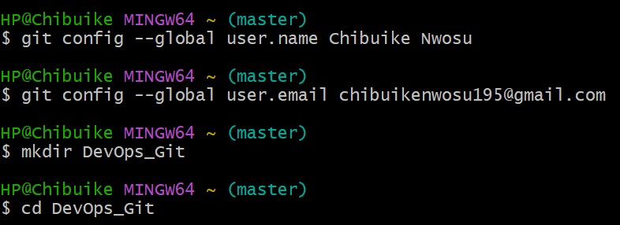
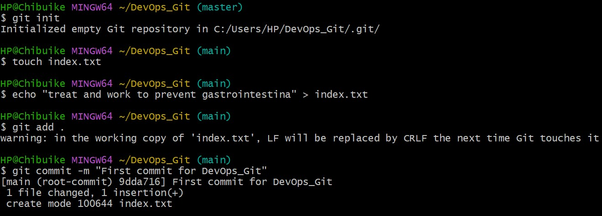
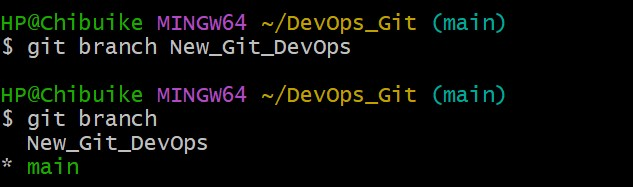
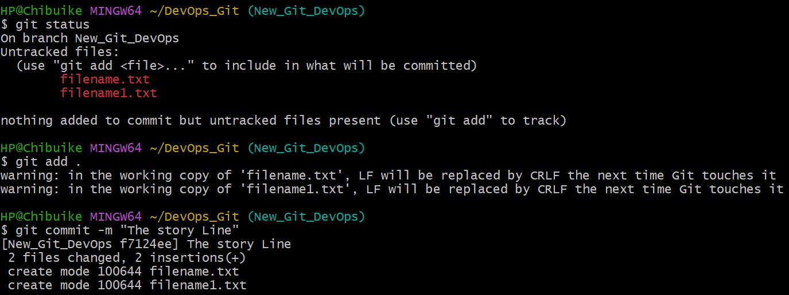
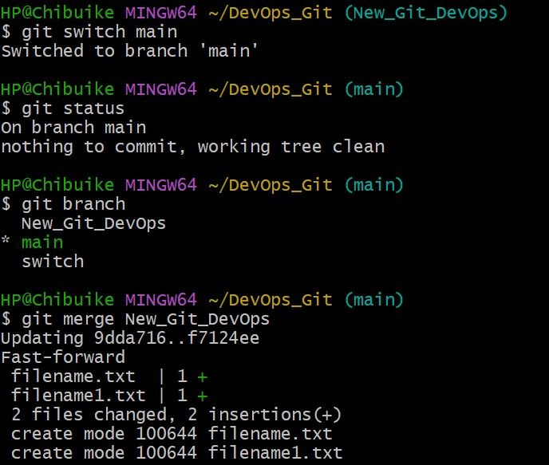
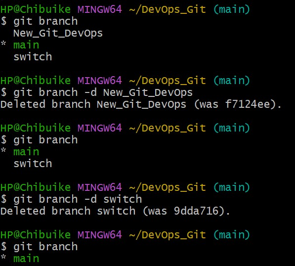
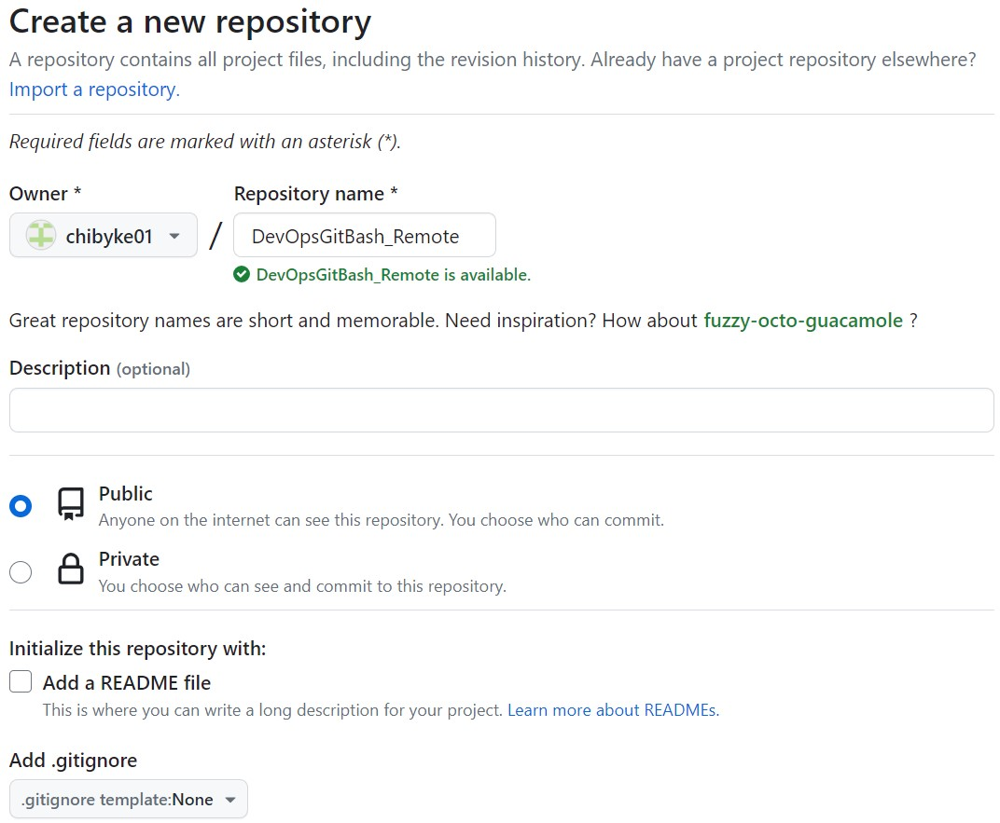
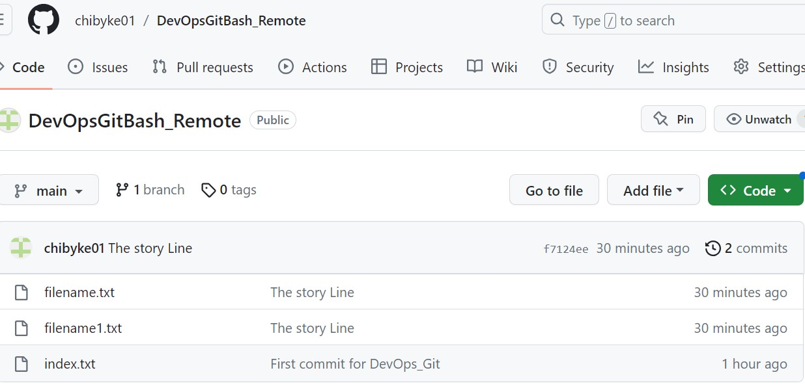
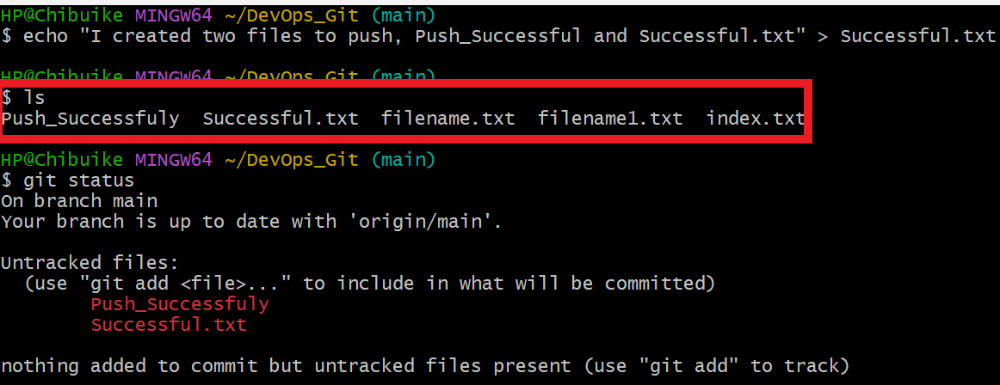
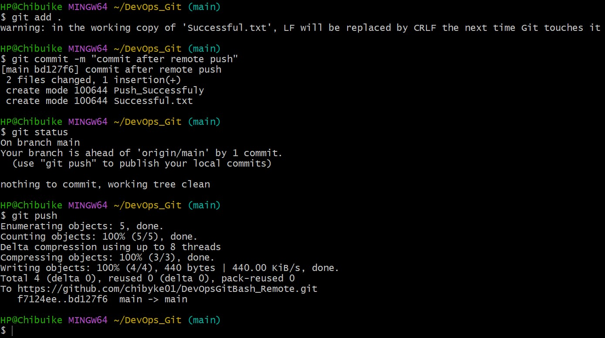

# GIT PROJECT

GIT is a version control system (VCS) that assist teams to collaborate and track projects.

To get started with this project I installed the Git, as this comes with a terminal called GitBash, but other terminals can be used (e.g powershell and windows CLI etc.) but you will be required to install the git terminal if you are using any of the compartiable CLI.

## Initializing a Git Repository and Making Commits

Opened the GitBash terminal and signed in using your name and email using the below git cmds as this helps to keep record of activities log information for activities carried out by any individual. 

        git config --global user.name <name>
        git config --global user.email <emailaddress>

Create a directory/folder, open the current directory(cd) and run the init cmd as this will create a new local repository in the system. 

        mkdir DevOps_Git
        cd DevOps_Git
        git init

Created files with contents inside, used the commit cmd to move the file and its contents to the local respository. 

        touch index.txt
        echo "contents in the file" > "filename.txt"
        git add .
        git commit -m "treat and work to prevent gastrointenstina"

## Git Branches
Created a new git branch, switched to the new branch, added files to the newly created branch and commit the file to the new branch.

        git branch
        git branch New_Git_DevOps
        git switch New_Git_DevOps
        touch filename.txt filename1.txt
        git add .
        git commit -m "The Story Line"

Switch, Merge and Delete a branch.

        git switch main
        git branch -d New_Git_Devops 
        git merge "the branch to merge"
        git status

## Remote Repositories/Connecting to Cloud GitHub Repository

Create a new repository in the cloud

Run the below cmd to push the Local repository to the cloud.

        git remote add origin https://github.com/chibyke01/DevOpsGitBash_Remote.git
        git branch -M main
        git push -u origin main

The below output shows a successful push to the cloud repository as the files created previously can be seen in the screenshot below.

To push or update any file or folder this can be done using the GitBash terminal, create a new file using the GitBash terminal and push to the cloud github.

The below screenshot concludes teh success of this project.

## _Thank you_

